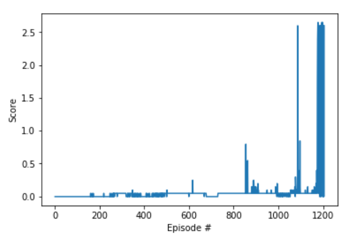

# Multi Agent Deep Deterministic Policy Gradient

This report describes the implemenation of a multi agent deep deterministic policy gradient (MADDPG) to solve the tennis problem.

## Learning Algorithm

This problem is solved using a multi agent deep deterministic policy gradient approach. This is an actor critic method that uses an actor neural network and a critic network to approximate the optimal value function and policy for two agents. 

Following the architecure and hyperparameter settings from my previous [DDPG solution](https://github.com/ajkeith/control-ddpg), the actor neural network architecture consists of two 256-node linear hidden layers with batch normalization in between and with ReLU (rectified linear unit) and tanh activation functions. 

The critic neural network architecure consists of two 256-node linear hidden layers (plus action nodes on the second), followed by batch normalization, followed by a 256-node linear hidden layer, followed by a 128-node hidden layer. This network uses leaky ReLU activation functions to prevent plateaus in learning. 

The overall hyperparameters are:
- Replay buffer size: 1e6
- Minibatch size: 128
- Discount factor: 0.99
- Soft update factor: 1e-3
- Initial noise epsilon: 1.0
- Noise decay: 0.9995
- Minimum noise: 0.01
- Network update frequency: 2

The training hyperparameters are:
- Max training episodes: 1500
- Max timesteps per episode: 1000

These parameters were chosen based on my previous [DDPG solution](https://github.com/ajkeith/control-ddpg).

## Results

This implementation solved the problem by achieving an average reward of at least +0.5 over 100 episodes in less than 1500 total episodes. The full results are shown below. The saved weights are available for the [actor](./checkpoint_actor.pth) and the [critic](./checkpoint_critic.pth). 

## Future Work

The agent's performance could be improved by implementing various alternative algorithms like multi agent PPO or with more sophisticated network architectures. It would also be interesting to consider a more competitive reward structure in which the agent gets a reward for making the ball hit the opponent's floor. 
